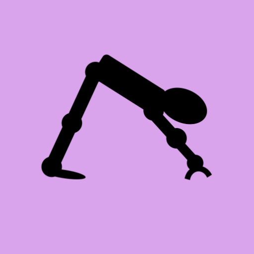

# Yoga Bot

A web app that leads you through a yoga session.

[Go yoga now!](https://skedwards88.github.io/yoga/)

Do you have feedback or ideas for improvement? [Open an issue](https://github.com/skedwards88/yoga/issues/new).

Want a fitness bot? Visit [CnS Games](https://skedwards88.github.io/fitness/).

Want some games? Visit [CnS Games](https://skedwards88.github.io/portfolio/).

## Development

To add a new pose, add an entry to the relevant file in `src/asanas`.

To build, run `npm run build`.

To run locally with live reloading and no service worker, run `npm run dev`. (If a service worker was previously registered, you can unregister it in chrome developer tools: `Application` > `Service workers` > `Unregister`.)

To run locally and register the service worker, run `npm start`.

To deploy, push to `main` or manually trigger the `.github/workflows/deploy.yml` workflow.
